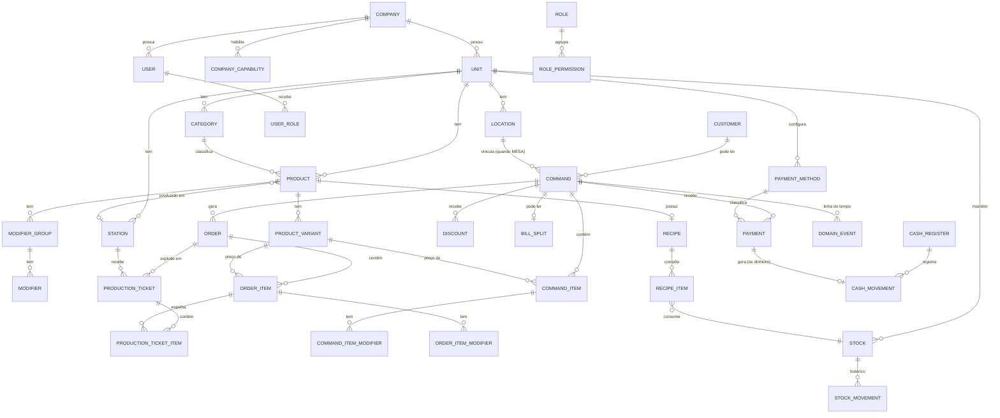

# 02 — Agregados e Entidades

> **Agregado**: um grupo de objetos tratado como uma unidade para mudança de
> estado. Tem uma **raiz** (a única porta de entrada) e uma **fronteira de
> consistência**: tudo dentro dela fica consistente ao fim de cada transação.
> Referência entre agregados é sempre **por ID**, nunca por objeto.

---

## 1. Lista de agregados

| Agregado (raiz) | Contém | Invariante principal |
|-----------------|--------|----------------------|
| `Company` | `Unit[]`, `Capability[]` | Slug único; ao menos 1 unidade ativa. |
| `User` | `Role[]` (por unidade) | E-mail único por empresa. |
| `Product` | `ProductVariant[]`, `ModifierGroup[]` → `Modifier[]`, `Recipe` | Tem ≥1 variação ativa OU preço próprio; soma de min/max dos grupos coerente. |
| `Category` | — | Nome único por unidade. |
| `Location` | — | Código de QR único por empresa. |
| `Command` | `CommandItem[]`, `Discount[]`, `BillSplit?` | Total = Σ itens − descontos; só fecha se saldo = 0; item não some, é cancelado. |
| `Order` | `OrderItem[]` | Pertence a 1 comanda aberta; não pode ser enviado vazio. |
| `ProductionTicket` | `ProductionTicketItem[]` | Roteado para exatamente 1 estação; segue a máquina de estados. |
| `Payment` | — | Valor > 0; confirma só via confirmação da fonte (webhook PIX / operador). |
| `CashRegister` | `CashMovement[]` | Só 1 sessão aberta por operador/unidade; fecha com contagem informada. |
| `Stock` | `StockMovement[]` | Saldo = Σ movimentos; não fica negativo sem flag `allow_negative`. |
| `DomainEvent` | — | Imutável; `id` (ULID) único; `published_at` nulo até despacho. |

> **Por que `CommandItem` e `OrderItem` são coisas diferentes** (ADR-006): o
> mesmo consumo tem duas visões — financeira (fica na comanda até o fechamento,
> participa da divisão de conta) e de produção (nasce num pedido, é roteado,
> muda de estado, pode ser cancelado só na cozinha). No MVP a linha física é
> uma só, mas modelamos separado para não travar cenários da Fase 2/3
> (transferir mesa, cancelar na produção sem estornar da comanda, etc.).

---

## 2. Diagrama ER (MySQL) — visão MVP



> Se o Mermaid não renderizar no seu editor, o mesmo conteúdo está descrito em
> texto no doc 03.

---

## 3. Detalhe dos agregados centrais

### 3.1 `Command` (comanda) — agregado mais importante

**Estado:**
```
id (ULID)              company_id, unit_id
display_number         # 42  (sequencial por unidade/dia)
bind_type              MESA | BALCAO | CLIENTE | QUARTO | PULSEIRA | EVENTO | VEICULO | SERVICO | AVULSO
bind_ref               ULID da Location (se MESA) | id do Customer | código da pulseira | texto livre
customer_id?           opcional
opened_by (user_id)    quem abriu
status                 OPEN | AWAITING_PAYMENT | PARTIALLY_PAID | PAID | CLOSED | CANCELLED
opened_at, closed_at
items[]                CommandItem
discounts[]            Discount (nível comanda)
totals (calculado)     subtotal, discount_total, service_fee?, total, paid_total, balance
```

**Invariantes (o que o código NÃO deixa violar):**
1. `total = subtotal − discount_total (+ service_fee)`; `balance = total − paid_total`.
2. Não adiciona item se `status ∉ {OPEN}`.
3. Não fecha (`CLOSED`) se `balance ≠ 0`.
4. Cancelar comanda exige que ela esteja `OPEN` e sem pagamento confirmado
   (senão é estorno, outro fluxo).
5. Item nunca é deletado: recebe `status = CANCELLED` + motivo + autor.
6. Desconto acima da faixa do operador → item/comanda fica `pending_authorization`
   e **não** entra no total até aprovação (ver doc 06).

**Comportamentos (métodos da raiz):**
`open()`, `addItem(variant, qty, modifiers[], notes)`, `changeItemQty()`,
`cancelItem(itemId, reason)`, `applyDiscount(scope, value, authorizedBy?)`,
`sendPendingItemsToKitchen()` → devolve um `Order`,
`registerPayment(payment)`, `split(strategy)`, `close()`, `cancel(reason)`,
`reopen(authorizedBy)`.

### 3.2 `Order` (pedido)

```
id, company_id, unit_id, command_id
channel          TABLE | COUNTER | QR | DELIVERY | WHATSAPP | KIOSK | API
placed_by        user_id (ou null se cliente via QR)
status           CREATED | SENT | PARTIALLY_READY | READY | DELIVERED | CANCELLED
items[]          OrderItem { variant_id, qty, unit_price, modifiers[], notes, station_id, status }
created_at, sent_at
```

**Invariantes:**
1. Só cria contra `Command` com `status = OPEN`.
2. `SENT` exige ≥1 item.
3. `status` do pedido é derivado do estado dos itens (todos `READY` → pedido
   `READY`; todos `DELIVERED` → `DELIVERED`).
4. Cancelar item já `IN_PREPARATION` exige permissão e registra motivo (o
   insumo pode já ter sido consumido).

### 3.3 `ProductionTicket` (o que o KDS mostra)

```
id, company_id, unit_id, order_id, station_id
status        RECEIVED | IN_PREPARATION | READY | DELIVERED | CANCELLED
items[]       ProductionTicketItem { order_item_id, product_name, qty, modifiers_text, notes }
received_at, started_at, ready_at, delivered_at   # base das métricas da seção 15
```

Um `Order` com itens de cozinha **e** de bar gera **dois** tickets. Cada estação
só vê o seu.

### 3.4 `Payment`

```
id, company_id, unit_id, command_id, cash_register_id?
method_id           FK PaymentMethod
kind                CASH | PIX | CARD_DEBIT | CARD_CREDIT | VOUCHER | OTHER
amount              BIGINT centavos
status              PENDING | CONFIRMED | FAILED | REFUNDED | CANCELLED
external_ref?       txid do PIX / NSU do cartão
confirmed_at?
```

**Regra PIX (seção 23):** cria `PENDING`, gera QR, aguarda **webhook**; só
`CONFIRMED` muda o `balance` da comanda. Nunca confiar em "o cliente disse que
pagou".

### 3.5 `CashRegister` (sessão de caixa)

```
id, company_id, unit_id, operator_id
status              OPEN | CLOSED
opened_at, opening_amount
closed_at?, counted_amount?, expected_amount?, difference?
movements[]         CashMovement { type: SALE|WITHDRAWAL|DEPOSIT|CHANGE|ADJUSTMENT, amount, payment_id?, reason?, created_by }
```

Fechamento "às cegas": operador informa `counted_amount` sem ver o esperado; o
sistema calcula `difference` e gera alerta se ≠ 0 (seção 43).

---

## 4. Value Objects (em `Domain\Shared`)

| VO | Encapsula | Regras |
|----|-----------|--------|
| `Money` | `int amount` (centavos) + `string currency` | soma/subtração só mesma moeda; `allocate([pesos])` para divisão de conta decide o centavo restante. |
| `Quantity` | `int` ou `decimal(10,3)` | > 0; unidade (un, kg, L). |
| `CompanyId`, `UnitId`, `UserId`, `CommandId`... | ULID validado | evita passar string crua e trocar um ID por outro. |
| `ModifierSelection` | lista de `modifier_id` + preço no momento | valida min/max do grupo. |
| `BindTarget` | `bind_type` + `bind_ref` | valida combinação (MESA exige Location existente). |

---

## 5. Nota de estudo — "por que não mapear a linha do banco direto para um objeto?"

Sem ORM (ADR-011), a tentação é ter uma classe "registro" com getters/setters
públicos que espelha a tabela e é o que o repositório devolve. Mas:
- ela teria setter para tudo → não protege invariante nenhuma;
- misturar "como está no banco" com "o que a regra permite" espalha `if` de
  validação por toda parte.

Então: a **entidade de domínio** (`Domain\Command\Command`) é uma classe PHP
pura, com estado privado e métodos que garantem as regras. O **repositório**
(`Infrastructure\Persistence\Repositories\PdoCommandRepository`) faz o SQL e um
**mapeador** traduz `array` de linhas ⇄ entidade. Custa um mapeamento a mais — e
é exatamente o que você quer praticar neste projeto.

Se em algum ponto isso ficar pesado demais para o MVP, a alternativa honesta é
"objeto de persistência com regras nos métodos + testes com banco" — mas aí
registre como novo ADR revisando a ADR-002.

---

## Histórico

| Data | Mudança |
|------|---------|
| 2026-08-29 | Versão inicial. |
| 2026-08-29 | Nota de estudo §5 reescrita para PDO + mapeador (ADR-011), sem Eloquent. |
| 2026-08-30 | Renomeado `Tenant` -> `Company` (tabelas `companies`, `company_capabilities`; coluna `company_id`; `CompanyContext`). O termo "multi-tenant" vira "multiempresa". |
